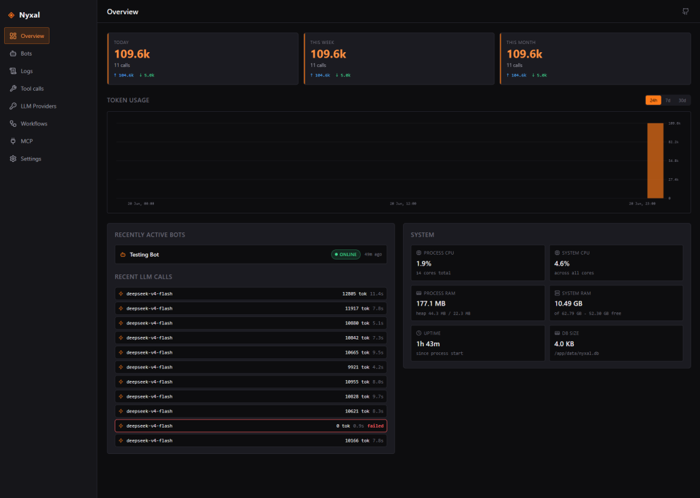
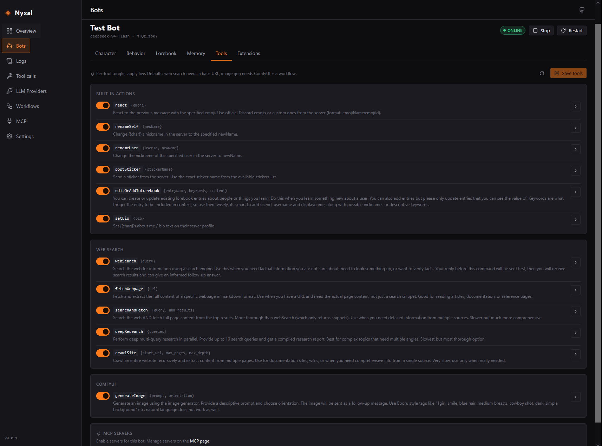

# Nyxal

Nyxal is a self-hosted runtime and dashboard for character-driven LLM bots on
Discord. It runs multiple bots from a single process, configured entirely through
a web UI, with everything persisted to SQLite.

It is a port of
[CharacterDiscordBot](https://github.com/StealthNinja1O1/CharacterDiscordBot),
rewritten on Bun with a full-stack dashboard and several extensions. Consider the old project archived.



## What it is

Each bot roleplays as a character defined by a definition (name,
description, examples, depth prompt, lorebook). Responses come from any
OpenAI-compatible API, including local LLMs. The bot uses a DIY tool-calling
system that works with any model, not just tool-calling ones: the model returns
structured JSON with a reply and an optional list of commands (reactions,
stickers, image generation, lorebook edits), which Nyxal executes on Discord.

Edits apply to a running bot without a restart, and a websocket feed streams
status, logs, and usage stats in real time.



## Features

### Bots and characters
- Run multiple bots from one process, each with its own config and character
- Smart triggers: mentions, character name, configured keywords, random replies
- Token-aware context that trims history to fit the model's limit
- Timestamps and Discord presence/activities optionally included in context
- Channel allowlists and ignored-bot filters

### Tools and commands
- **Per-command control** - toggle each tool on or off per bot, override its
  description, with sensible defaults
- Reactions (unicode + custom server emojis), nicknames, stickers
- Dynamic memory: the bot can create and update its own lorebook entries as it
  learns, without touching the read-only static lorebook
- Image generation via ComfyUI
- Web search
- MCP (Model Context Protocol) servers for extending the tool set over HTTP

### Prompts and lorebooks
- **Per-character system prompt override** - edit the built-in template per bot,
  or load the default as a starting point
- Static lorebook (read-only) merged with the bot's
  dynamic memory book
- Depth prompts injected near the end of history for high-priority instructions
- Character Card V2 import

### Dashboard
- Live overview with status cards, a token-usage chart, and a log stream
- Bot detail tabs: behavior, character, tools, lorebook, memory, extensions
- Mobile-friendly UI
- Log history restored on reconnect, filterable by level, with retention pruning
- SQLite local database, just do not delete it yourself

### Runtime
- Hot-reload for behavior, temperature, model/provider swaps, character edits,
  and tool toggles (no restart needed)
- "Restart required" badge for token or intent changes that need a reconnect
- Discord access abstracted behind an adapter so the library is swappable

## Quick start (development)

Requirements: [Bun](https://bun.com) and a Discord bot token.

```bash
bun install
bun run dev        # server on :3000, vite on :5173
```

Open http://localhost:5173. The dev server proxies API and WebSocket traffic to
the backend.

## Deployment

Nyxal ships as a single self-contained binary or as a Docker image. See releases or the [Docker compose file](/docker-compose.yml)

Quick reference:

```bash
# run the prebuilt binary
./nyxal              # opens http://localhost:3000

# build a single-file binary
bun run compile

# docker
docker compose up -d
```

Configuration is via environment variables: `NYXAL_PORT`, `NYXAL_DB_PATH`,
`NYXAL_LOG_RETENTION_DAYS`, `NYXAL_LOG_HISTORY`. See `.env.example`.

## Tech stack

- **Backend:** Bun, Elysia, Drizzle ORM, bun:sqlite, discord.js
- **Frontend:** Vite, Preact, @preact/signals, wouter
- **Tooling:** Drizzle migrations, WebSocket for live updates, MCP SDK for
  extensible tools

## License

See [LICENSE](./LICENSE).